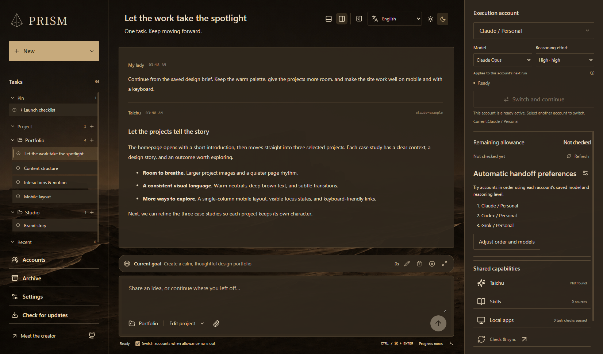
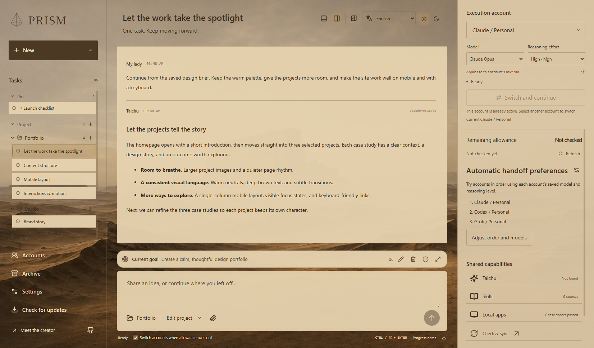
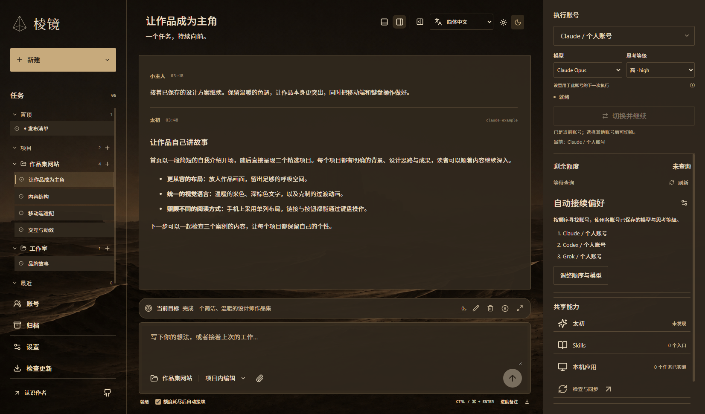

# Prism Desk · 棱镜


[English](README.md) · [简体中文](README.zh-CN.md) · [繁體中文](README.zh-TW.md) · [日本語](README.ja.md) · [한국어](README.ko.md) · [Español](README.es.md) · [Français](README.fr.md) · [Deutsch](README.de.md) · [العربية](README.ar.md)

**하나의 작업, 계속 앞으로.**

**Codex, Claude Code, Grok**을 하나의 Windows 데스크톱에서 사용하세요. 구독 계정, 프로젝트 폴더, 대화를 한곳에 모으고 계정을 바꿔도 작업을 이어갈 수 있습니다.

여러 AI 코딩 CLI로 제품을 개발하거나 웹사이트와 창작 프로젝트를 만드는 분들을 위한 도구입니다. 터미널 전환과 반복 설명을 줄이고 작업에 집중하세요.

**[최신 릴리스](https://github.com/shixi-11/prism-desk/releases/latest)** · **[설치 안내](#install)**

[](output/20260912_prism-en-dark.png)

*실제 Prism 데스크톱 앱에 예제 대화와 계정 이름을 표시한 화면입니다. 개인 계정 정보는 포함하지 않습니다.*

### Prism을 사용하는 이유

- **계정을 바꿔도 작업은 계속됩니다.** 원래 요청, 대화, 진행 메모, 기록된 도구 결과가 같은 작업에 남고 프로젝트 파일도 제자리를 유지합니다.
- **한 프로젝트에서 여러 일을 함께 진행하세요.** 구현, 검토, 조사를 별도 대화로 나누고 같은 작업 폴더에서도 동시에 실행할 수 있습니다.
- **작업 중에도 추가 지시를 보내세요.** Codex, Claude, Grok 실행 중 실시간 지시나 대기열을 선택할 수 있으며 중지와 승인은 대화별로 처리됩니다.

### 할 수 있는 일

| 기능 | 실제 사용 방식 |
| --- | --- |
| 대화 병렬 실행 | 같은 프로젝트와 동일하거나 중첩된 폴더에서도 여러 대화를 동시에 실행하며 각각 독립적으로 중지하거나 지시할 수 있습니다. |
| 실행 중 추가 지시 | 실행 중인 Codex, Claude, Grok 기본 대화에 메시지를 보냅니다. 현재 생성이나 도구 단계가 끝난 뒤 처리될 수 있습니다. |
| 같은 작업 이어서 진행 | 다른 계정으로 작업을 넘길 때 최초 요청, 대화, 진행 메모, 기록된 도구 실행 결과를 함께 유지합니다. |
| 실행 계정 선택 | 설정된 Codex, Claude 또는 Grok CLI 프로필을 선택합니다. 각 프로필은 별도의 로그인 디렉터리를 사용합니다. 사용하지 않는 계정은 계정 패널에서 제거할 수 있으며, 작업 기록과 로컬 로그인 폴더는 유지됩니다. |
| 모델 및 추론 설정 변경 | 작업 중에 두 설정을 각각 조정할 수 있습니다. 변경 사항은 다음 실행에 적용되며, 해당 작업 안에서 계정별로 저장됩니다. |
| Codex Fast 모드 | 지원 모델의 응답 속도를 높이며 크레딧 사용량이 늘어납니다. 기본값은 꺼짐이며, 작업 내 계정별로 저장되어 추론 수준을 바꾸지 않고 다음 실행부터 적용됩니다. |
| 사용 한도 확인 | 공급자가 제공한 비율, 사용 한도 기간, 초기화 시각을 확인합니다. Codex 초기화 크레딧은 응답에 포함된 경우 각 크레딧의 만료일도 표시합니다. |
| 한도 소진 후 인계 | 자동 인계를 켜거나 다음 계정을 직접 선택합니다. Prism은 이전 실행이 끝날 때까지 기다린 후 작업을 이어갑니다. |
| 로컬 스킬 및 도구 사용 | Prism에 어시스턴트 지침, 스킬 폴더, 설치된 애플리케이션을 지정합니다. 검색된 진입점과 지원되는 애플리케이션 작업을 확인할 수 있습니다. |
| 작업을 로컬에 보관 | 영구 작업 저장 폴더를 선택하고, 진행 메모를 추가하고, 대화 기록을 Markdown으로 내보냅니다. |
| 원하는 언어로 작업 | 오른쪽에서 왼쪽으로 표시되는 아랍어를 포함한 아홉 가지 인터페이스 언어 중에서 선택하고, 밝은 사막 테마와 어두운 사막 테마를 전환할 수 있습니다. |

서로 다른 대화는 쓰기 권한이 있어도 같거나 겹치는 작업 디렉터리에서 동시에 실행할 수 있습니다. 같은 대화의 메시지는 순서대로 실행됩니다. 중지와 지시는 해당 대화에만 적용되며, 대기 중인 대화에서 선택한 계정은 즉시 저장됩니다.

프로젝트를 오른쪽 클릭하면 고정, 이름 편집, 구역 선택, 영구 Git 작업 트리 생성, 모두 읽음 표시, 채팅 보관, 프로젝트 제거를 사용할 수 있습니다. 제거해도 파일과 대화는 보존됩니다. 작업 트리는 현재 Git 커밋에서 생성됩니다.

### 버전 및 다운로드

**[최신 릴리스](https://github.com/shixi-11/prism-desk/releases/latest)** · **[설치 안내](#install)**

Prism은 현재 **Windows 소스 설치** 방식으로 제공됩니다. 독립형 `.exe` 또는 `.msi` 설치 프로그램은 배포하지 않습니다. GitHub의 “Source code” 다운로드에는 소스 파일이 들어 있습니다. 설치 안내에 따라 데스크톱 앱을 빌드하고 실행하세요. 각 안정 버전 릴리스에는 버전 태그 하나와 영어 및 중국어 간체 변경 사항을 빠짐없이 담은 페이지 하나가 있습니다.

제작: [Shixi Lin](https://shixilin.com/). Prism이 창작에 도움이 된다면 [지속적인 개발을 후원해 주세요](https://shixilin.com/support?lang=ko).

<a id="install"></a>

### 설치

다음 명령은 안정 버전 **v0.1.28**을 설치합니다. [최신 릴리스](https://github.com/shixi-11/prism-desk/releases/latest)에서 버전과 두 언어로 제공되는 변경 사항을 확인하세요.

Windows, Git, Node.js 22.12 이상, npm, 그리고 선택한 공급자의 공식 CLI가 필요합니다. 각 CLI에 별도로 로그인하세요.

```powershell
git clone --branch v0.1.28 https://github.com/shixi-11/prism-desk.git
cd prism-desk
npm install
npm run build
npm run build:desktop
powershell -NoProfile -ExecutionPolicy Bypass -File scripts/build-host.ps1
powershell -NoProfile -ExecutionPolicy Bypass -File scripts/start.ps1
```

빌드 스크립트는 CLI 하위 프로세스를 함께 중지하는 데 사용하는 Windows 프로세스 호스트를 컴파일합니다. Windows에 포함된 .NET Framework 컴파일러를 사용합니다.

### 첫 작업을 시작하기 전에

사용하려는 각 공급자의 공식 CLI를 설치한 다음 해당 CLI를 통해 로그인하세요. 웹사이트나 데스크톱 앱에 로그인하는 것만으로는 Prism이 설정되지 않습니다.

- **Codex:** [CLI 설치 안내](https://developers.openai.com/codex/cli/)에 따라 설치하고 ChatGPT 계정으로 로그인하세요.
- **Claude:** [Claude Code](https://code.claude.com/docs/en/setup)를 설치한 다음, 지원되는 Claude 구독으로 [로그인](https://code.claude.com/docs/en/authentication)하세요. 실행 전에 구독 로그인을 확인합니다. 추가 사용량 설정으로 실행을 차단하지 않습니다.
- **Grok:** 공식 Grok CLI를 설치하고 구독 계정으로 로그인하세요.

**계정 → 계정 연결**을 열고 Codex, Claude 또는 Grok을 선택한 후 계정 이름을 지정하세요. **저장하고 계속 → 로그인 링크 가져오기 → 로그인 링크 복사**를 선택하면 공식 CLI 인증 절차가 시작됩니다. 링크를 브라우저 주소 표시줄에 붙여 넣으세요. Claude에 인증 코드가 표시되면 전체 코드를 **인증 코드**에 붙여 넣고 **인증 코드 제출**을 선택하세요. 코드는 대기 중인 공식 CLI에만 전송되며, 이후 입력란에서 지워집니다. 인증을 마치면 Prism이 구독 로그인을 검증하고 재시작 없이 계정을 사용할 수 있게 합니다. 이 페이지에서는 기존 로그인 확인, 인증 취소, 링크 다시 복사, 프로필 이름 변경, 계정 비활성화 및 활성화도 할 수 있습니다. 계정을 비활성화해도 이전 작업과 자격 증명은 유지됩니다. 고급 설정에서는 공식 CLI 실행 파일을 선택하거나 기존의 독립된 로그인 디렉터리를 가져올 수 있습니다. 이미 설정된 계정 디렉터리와 플랫폼 식별 정보는 변경할 수 없습니다. CLI가 없으면 공식 설치 안내 링크가 제공됩니다. 향후 추가되는 플랫폼에는 각각 별도의 공급자 어댑터와 실행 어댑터가 필요합니다.

### 일반적인 작업 흐름

1. **새로 만들기 → 새 대화**를 클릭하고 이름을 입력하세요. 작업 폴더를 비워 두면 별도의 영구 작업 공간을 사용하며, 저장된 프로젝트를 선택할 수도 있습니다. **새로 만들기 → 새 프로젝트**에서 폴더를 만들거나 기존 폴더를 파일 이동 없이 저장할 수 있습니다. 빈 프로젝트도 사이드바에 유지됩니다. 프로젝트 옆 **＋**를 누르면 해당 폴더에서 대화를 시작합니다. 여러 대화에서 같은 프로젝트를 사용할 수 있습니다.
2. 실행 계정, 모델, 추론 강도를 선택하세요. 검토에는 **읽기 전용**, 편집에는 **프로젝트 내 편집**을 사용하세요.
3. 요청을 입력하고 **Ctrl + Enter**로 전송하세요. 작업이 진행되는 동안 대화와 실행 로그를 확인할 수 있습니다.
4. 중요한 결정이나 남은 작업을 진행 메모에 추가하세요. 계정을 변경하려면 다음 계정을 선택하고 인계 기능을 사용하세요. 필요한 경우 먼저 현재 실행을 중지하세요.
5. 작업의 컨텍스트 메뉴, 더블 클릭 또는 **F2**로 이름을 바꿀 수 있습니다. **Enter**로 저장하거나 **Esc**로 취소하세요.
6. 같은 작업에서 계속 진행하세요. Markdown 사본이 필요하면 기록을 내보내거나, 작업 저장 폴더를 열어 로컬 파일을 찾으세요.

다음 계정은 저장된 대화, 진행 메모, 도구 기록을 전달받습니다. 공급자 내부의 모델 상태는 이전되지 않습니다.

### 메시지, 설정 및 미리 보기

#### 목표와 계획

메시지 입력 영역 위의 간결한 **목표 표시줄**에는 저장된 목표, 실행 상태, 누적 실행 시간이 표시됩니다. 표시줄에서 목표를 편집, 일시 중지, 재개 또는 삭제할 수 있으며, 펼치면 전체 목표, 편집 가능한 계획, 실행 세부 정보를 볼 수 있습니다. 일시 중지하면 현재 실행을 멈추고 대기열의 메시지를 보류합니다. 삭제는 실행이 중지될 때까지 기다린 후 목표를 제거하고, 처리 대기 중인 메시지를 검토할 수 있도록 보류합니다. 대화 기록과 작업 공간 파일은 계속 사용할 수 있습니다. 타이머에는 일시 중지 시간, 유휴 시간, 앱이 닫혀 있던 시간이 포함되지 않습니다. 공식 사용 한도 소진은 네트워크 또는 로그인 실패와 구분하여 표시됩니다.

Codex에 목표 설정이나 변경을 요청하면 Prism의 내장 도구를 통해 목표를 저장할 수 있습니다. 다른 실행 항목은 사용자가 인터페이스에서 채택할 목표를 제안할 수 있습니다. 채팅 내용에서 목표를 저장했다고 말하더라도 그 텍스트만으로 실제 목표가 변경되지는 않습니다. **먼저 계획 수립**은 읽기 전용 권한으로 실행되며 검토할 초안을 반환합니다. 메시지가 보류 중인 계획을 논의하는 용도로만 쓰일 때는 입력 영역에 이를 명확히 표시합니다. **계획 확인 후 실행**을 선택하면 작업에 설정된 권한으로 구현을 시작합니다. 목표와 계획은 세션이 바뀌어도 유지되며 인계 기록에도 남습니다.

#### 모델과 인계

**전환 후 계속**을 사용하면 같은 계정 내에서 모델 변경을 적용할 수 있습니다. 확정된 실행에는 계정, 모델, 추론 수준이 기록됩니다. 선택만 저장한 경우에는 전환이 완료된 것으로 표시하지 않습니다. **자동 이어가기 설정**을 열면 드래그하여 순서를 바꿀 수 있는 계정 목록과 각 계정의 모델 및 추론 수준 설정이 표시됩니다. 변경 사항은 현재 작업에 자동으로 저장됩니다. 목록에는 작업에 필요한 쓰기 권한을 충족하지 못하는 계정이 표시되며, 인계 시 이미지 지원 여부도 고려합니다.

#### 계정과 창

각 계정 카드에는 연필 버튼으로 편집할 수 있는 **별칭**이 있습니다. 표시 이름만 변경되며 로그인 식별 정보는 바뀌지 않습니다. Codex의 네이티브 질문과 지원되는 질문 및 선택지 목록 형식의 메시지에는 클릭 가능한 선택지와 직접 입력하는 답변이 제공됩니다. Windows 제목 표시줄의 **×**를 누르면 Prism이 알림 영역으로 숨겨집니다. 진행 중인 작업을 중지하고 종료하려면 트레이 메뉴에서 **Prism 종료**를 선택하세요.

#### 작업 정리

작업을 마우스 오른쪽 버튼으로 클릭하면 이름 변경, 고정, 읽지 않음으로 표시, 보관, 프로젝트 또는 섹션별 그룹화, 공유, 복사, 분기 생성, 폴더 또는 대화 열기, 다른 창 열기, 삭제를 할 수 있습니다. 사이드바의 **보관 및 삭제된 작업**에서 숨겨진 작업을 복원할 수 있습니다. 작업을 삭제해도 작업 공간과 대화 파일은 유지됩니다. 프로젝트 선택을 변경하면 이후 작업이 실행되는 위치가 바뀌며, 기존 파일은 원래 폴더에 남습니다. 분기를 생성하면 새로운 CLI 세션을 시작하고 대화 첨부 파일을 복사합니다. 별도 작업 공간 옵션을 선택하면 빈 폴더에서 시작합니다. 공유는 복사하거나 저장할 수 있는 로컬 Markdown 문서를 미리 보여 주며, 호스팅된 공개 링크를 만들지 않습니다. 작업 변경 사항은 열려 있는 창 사이에서 동기화됩니다.

실행 중이 아닌 대화를 다른 프로젝트 이름으로 끌어 놓으면 기록과 초안을 유지하면서 작업 폴더를 변경할 수 있습니다. 기존 파일은 원래 위치에 남고 다른 대화는 병합되지 않습니다.

**Fast** 스위치는 전송 버튼 옆에 있습니다. Prism 로고를 클릭하면 초안과 실행 중인 작업을 유지하면서 대화가 선택되지 않은 홈으로 돌아갑니다. Claude의 진행 메시지는 묶어서 표시하고, 성공한 실행의 최종 답변은 따로 보존합니다. 백그라운드 프로세스 호스트는 콘솔 창을 만들지 않으며, 동시에 요청된 모델 목록은 한 번의 CLI 조회를 공유합니다.

#### 보기와 사용 한도

상단 표시줄에는 하단 실행 로그 및 계정 사이드바의 표시 전환 기능이 있습니다. 표시 상태는 로컬에 저장됩니다. 계정의 **모든 계정 조회**은 설정된 모든 프로필을 조회하여 사용 가능한 한도, 초기화 시각, Codex 초기화 크레딧, 크레딧 만료일을 표시합니다. 한 계정의 조회가 실패해도 나머지 계정 조회는 계속됩니다.

#### 이미지

스크린샷을 붙여 넣거나, 이미지를 입력 영역에 끌어 놓거나, 이미지 버튼을 사용하세요. 최대 다섯 장까지 첨부할 수 있으며 각 이미지는 10 MB까지 가능합니다. Codex는 로컬 이미지를 전달받고, Claude는 구독 확인을 통과한 경우 네이티브 이미지 콘텐츠를 전달받습니다. Claude의 이미지 실행은 아직 로그인된 계정으로 검증하지 않았습니다. Grok은 CLI가 직접 이미지 콘텐츠 지원을 알리는 경우 해당 방식을 사용하고, 그렇지 않으면 내장 Read 도구로 첨부 이미지를 엽니다. 이 경로는 구독 계정에 로그인한 상태에서 검증했습니다.

#### 메시지와 초안

실행 중에도 메시지를 보낼 수 있습니다. 대기 메시지는 순서대로 처리되며 취소할 수 있습니다. 설정에서 Enter 또는 Ctrl/⌘+Enter와 대기열 또는 실시간 지시를 선택할 수 있습니다. Codex, Claude, Grok은 실행 중인 기본 대화에 추가 지시를 전달합니다. CLI는 현재 생성이나 도구 단계가 끝난 뒤 처리할 수 있습니다. 수신이 확인되지 않은 메시지는 검토를 위해 보관됩니다. 앱에서 작업을 전환해도 초안은 유지됩니다.

#### 파일 미리 보기

미리 보기 패널을 열거나 파일 링크를 클릭하면 이미지, PDF, Markdown, 코드, 텍스트를 볼 수 있습니다. 텍스트 파일은 편집하고 저장할 수 있으며, 저장 전에 외부 변경 사항을 확인합니다. HTML 미리 보기는 독립된 페이지를 표시합니다. 대화형 프로젝트는 실행 중인 HTTP 주소를 사용할 수 있습니다. 일부 웹사이트는 삽입 표시를 차단합니다. 활동 패널은 CLI가 제공하는 추론 요약, 계획, 실행 상태를 사용 가능한 경우 표시합니다.

### 자동 업데이트

1. **업데이트 확인**은 “새 버전이 있습니다” 또는 “최신 버전입니다”를 표시합니다. 다운로드하거나 재시작하지 않습니다.
2. **다운로드 및 준비**는 준비가 끝나면 “업데이트 준비 완료”를 표시합니다. 현재 버전을 계속 사용할 수 있습니다.
3. **업데이트 후 다시 시작**은 사용자가 클릭한 후에만 재시작합니다. 새 버전이 성공적으로 시작되면 “vX.X.X(으)로 업데이트되었습니다”가 한 번 표시됩니다. 일반 실행과 롤백에서는 이 성공 메시지가 표시되지 않습니다.

사이드바의 **업데이트 확인**은 공개된 안정 버전 [GitHub Releases](https://github.com/shixi-11/prism-desk/releases)를 기준으로 합니다. 다운로드 전에 설치된 버전, 사용 가능한 버전, 변경 사항을 보여 줍니다. **나중에**를 선택하면 현재 버전을 계속 사용할 수 있습니다. 일반적인 main 브랜치 커밋은 업데이트 알림을 발생시키지 않습니다. 자동 확인은 기본적으로 활성화되어 있으며, Prism은 시작 후와 이후 네 시간마다 확인합니다. 업데이트 확인 옆에 계속 켜져 있는 파란 점과 상단 표시줄의 업데이트 아이콘은 사용 가능한 버전이 있음을 나타냅니다. 확인만으로 앱을 다운로드하거나 설치하거나 재시작하지 않습니다. 편할 때 **다운로드 및 준비**를 선택한 다음 **업데이트 후 다시 시작**을 선택하세요. 파란 점은 설치된 리비전이 최신 상태가 될 때까지 표시됩니다. 재시작 전에 각 창의 초안을 저장합니다. 작업, 대기열 메시지, 계정 작업, 편집 대화 상자, 미리 보기가 있으면 완료되거나 닫힐 때까지 재시작이 차단됩니다.

업데이트 후에도 동일한 계정 설정, 작업 저장소, 사용자 데이터 디렉터리를 유지합니다. 원래 체크아웃과 이전 설치도 계속 사용할 수 있습니다. 다운로드나 빌드에 실패해도 실행 중인 버전은 그대로 유지됩니다. 새 앱이 시작을 완료하지 못하면 Prism을 다시 열 때 이전 버전으로 복원됩니다. 로컬 소스 변경 사항이 있으면 업데이트가 차단되며, 업데이트 준비에는 최소 2 GB의 여유 공간이 필요합니다. Git은 계속 설치되어 있어야 합니다. 데스크톱 빌드에는 이후 빌드에 필요한 Node 런타임과 npm이 포함되어 있습니다. 이 업데이트 기능이 도입되기 전에 설치한 경우에는 위 설치 명령을 사용하여 한 번 수동으로 풀하고 다시 빌드해야 합니다.

### 실제 데스크톱 화면

같은 작업 공간을 밝은 테마와 어두운 테마로 볼 수 있습니다. 이미지를 클릭하면 원본 크기로 열립니다.

| 밝은 테마 · 영어 | 어두운 테마 · 영어 |
| --- | --- |
| [](output/20260912_prism-en-light.png) | [](output/20260912_prism-en-dark.png) |

<details>
<summary>중국어 인터페이스</summary>

[](output/20260912_prism-zh-dark.png)

</details>

### 설정

대부분의 사용자는 **계정 → 계정 연결**에서 계정을 연결할 수 있습니다. 아래 설정 파일은 고급 사용자를 위한 대안입니다. 예제를 복사하기 전에 기존 파일을 백업하세요.

```powershell
New-Item -ItemType Directory -Force .local
Copy-Item config.example.json .local/config.json
```

컴퓨터 환경에 맞게 `.local/config.json`을 편집하세요. `PRISM_CONFIG`에 설정 파일의 절대 경로를 지정할 수도 있습니다.

단일 계정 설정은 다음과 같습니다. 예제 로그인 디렉터리를 자신의 디렉터리로 바꾸고, 해당 계정에서 사용할 수 있는 모델을 선택하세요. `profiles`에 항목을 추가하면 실행 계정이 늘어납니다.

```json
{
  "profiles": [
    {
      "id": "codex-personal-1",
      "provider": "Codex",
      "name": "Personal 1",
      "home": "C:/PrismAccounts/codex-personal-1",
      "executable": "codex.exe",
      "model": "gpt-5.6-sol",
      "write": true
    }
  ]
}
```

| 필드 | 용도 |
| --- | --- |
| `profiles` | 실행 계정: ID, 공급자, 표시 이름, 로그인 디렉터리, 실행 파일, 모델, 쓰기 권한 |
| `storageRoot` | 작업 기록의 영구 저장 위치 |
| `assistant.path` | `SKILL.md`를 포함하는 선택적 어시스턴트 디렉터리 |
| `assistant.instructions` | 작업 간에 공유하는 선택적 지침 |
| `skillsPath` | 공유 스킬 디렉터리 |
| `apps` | 애플리케이션 이름과 실행 파일 또는 진입 파일 경로의 매핑 |

로컬 리소스에는 절대 경로를 사용하고, 계정마다 별도의 로그인 디렉터리를 사용하세요. 프로필 ID는 유지하세요. 기존 작업은 이 ID로 계정을 식별합니다. 기본 프로필 구조는 [electron/config.cjs](electron/config.cjs)에 정의되어 있습니다.

`storageRoot`를 설정하지 않으면 작업은 애플리케이션의 사용자 데이터 디렉터리에 저장됩니다. 로그인 자격 증명은 공급자 자체 디렉터리에 보관됩니다. 로컬 설정, 작업 기록, 로그는 Git에서 제외됩니다.

### 파일 및 명령 권한

입력 영역에서 **읽기 전용**, **프로젝트 내 편집**, **전체 접근**을 선택하세요. Codex, Claude, Grok에서 전체 접근을 사용할 수 있습니다. 운영체제 권한 범위 내에서 프로젝트 외부 파일에 접근할 수 있고 도구 실행을 자동 승인합니다. 실행 중에 변경한 설정은 다음 실행에 적용되도록 대기합니다. 새로 설치하면 지원되는 계정의 기본값은 프로젝트 편집입니다. **새 작업의 기본 권한으로 설정**을 선택하면 선호 설정을 저장할 수 있으며, 기존 작업은 각자의 권한을 유지합니다. 읽기 전용 어댑터는 계속 읽기 전용으로 유지됩니다.

### 계정과 로컬 도구

Codex, Claude, Grok 어댑터는 파일 편집 작업을 지원합니다. Grok은 선택한 작업 권한을 따릅니다. 읽기 전용은 편집 및 셸 도구를 비활성화하고, 프로젝트 편집은 CLI 작업 공간 프로필과 작업 확인을 사용하며, 전체 접근은 도구 실행을 허용합니다. `write: false`인 기존 프로필은 명시적으로 활성화할 때까지 읽기 전용으로 유지됩니다. 사용 가능한 모델은 설치된 CLI와 선택한 계정에 따라 달라집니다.

사용 한도 패널은 공급자가 반환한 정보를 표시합니다. 유효한 Grok 통합 한도 기간에서는 사용량이 0이라 생략된 값을 공식 클라이언트의 해석에 따라 처리합니다. 비어 있거나 형식이 잘못되었거나 만료된 응답은 알 수 없는 상태로 유지합니다. Claude 조회는 일시적인 연결 실패나 사용량 응답 누락 후 한 번 재시도하지만, 인증 실패 후에는 재시도하지 않습니다. 인증 또는 네트워크 오류를 한도 소진으로 간주하여 계정을 전환하지 않습니다. 자동 인계에는 인식 가능한 한도 소진 응답과 이전 실행의 완료가 필요합니다.

계정 이메일 주소는 기본적으로 가려집니다. 눈 모양 버튼으로 표시하거나 숨길 수 있습니다. 조회 기록은 이 기기에 보관됩니다. 재시작 후에도 기록은 원래 날짜와 시간을 유지하며 새로 고침이 필요한 것으로 표시됩니다. 과거 조회값은 실행이나 초기화 크레딧 사용을 승인하는 근거로 절대 사용되지 않습니다.

Prism은 API 키 과금으로 전환하거나 크레딧을 구매하지 않습니다. 잔여량 조회로 실행을 차단하지 않으며 추가 사용량 알림도 제거했습니다. 이용 가능 여부와 과금은 제공자 계정 설정에 따릅니다. 기존 Codex 초기화 크레딧은 해당 계정에 대한 별도 확인이 필요합니다. 실행 중인 대화를 중단하거나 끝난 실행을 다시 시작하지 않습니다.

원형 전송 화살표는 실행 중 중지 버튼으로 바뀝니다. 추가 지시 전달과 대기열 추가는 유지하며 음성 기능은 추가하지 않습니다.

어시스턴트 파일과 스킬은 계정 간에 공유할 수 있습니다. MCP 권한과 애플리케이션 연결은 실행 환경마다 설정해야 합니다. 애플리케이션 검색은 설치된 진입점을 나열하며, 검증 작업은 지원되는 작업을 별도로 확인합니다.

**공유 기능**에서 **공유 기능 확인 → 로컬 최신 내용 동기화**를 선택하면 스킬 파일과 경로를 이전 동기화와 비교합니다. 시스템 스킬과 추가 폴더는 동기화 후 공유 인덱스에 포함됩니다. **설치된 플러그인 연결**은 로컬 Codex가 보고한 플러그인을 일괄 등록하고 읽을 수 있는 스킬 자료를 연결합니다. 자동 동기화도 켜지며 **소스 및 연결**에서 끌 수 있습니다. 시작 시, 창으로 돌아올 때 또는 5분마다 확인합니다. 비활성화, 제거 또는 수동 제외한 플러그인은 자동으로 다시 추가하지 않습니다. 원본 파일은 그대로 두고 다음 작업 턴에 참조 인덱스를 전달합니다.

목록에는 실제 설치된 버전을 사용하며 더 최신인 캐시 버전으로 대체하지 않습니다. 캐시에만 있는 플러그인은 따로 표시할 수 있지만 일괄 연결에서 제외됩니다. 설치 확인이 실패하면 이전 목록을 유지하고 자동 연결을 중단합니다. 등록과 자료 읽기는 도구 연결이나 인증 완료를 의미하지 않으며 연결 상태는 별도로 표시됩니다. Codex MCP는 각 계정의 독립 CLI에서 설정하고 검증해야 합니다. 현재 Claude, Grok, Gemini 실행 채널에서는 외부 MCP를 활성화하지 않습니다. 원래 데스크톱 앱 전용 도구는 미지원으로 표시됩니다. 자료 동기화는 로그인 자격 증명과 API 키를 복사하거나 도구 권한을 활성화하지 않습니다.

### 개발

```powershell
npm test
npm run build
npm run build:desktop
```

단위 테스트는 격리된 계정 테스트 데이터를 사용합니다. 선택 사항인 데스크톱 및 실제 CLI 검증은 [scripts/README.md](scripts/README.md)에 설명되어 있습니다. 실제 검증에는 테스트 계정이 필요하며 구독 사용 한도가 소모될 수 있습니다.

문제를 보고할 때는 앱과 CLI 버전, 재현 단계, 민감 정보를 가린 오류 메시지를 포함하세요. 게시 전에 자격 증명, 계정 세부 정보, 비공개 대화 내용을 제거하세요.

### 기여자 릴리스 규칙

배포하기 전에 [AGENTS.md](AGENTS.md)와 [RELEASING.md](RELEASING.md)를 읽으세요. 모든 소프트웨어 릴리스에는 새 버전, 변경할 수 없는 태그 하나, 완전한 영어 및 중국어 간체 릴리스 노트가 필요합니다. `npm run release:check`와 해당 변경에 필요한 검증을 실행하세요. 문서만 수정한 경우에는 새 소프트웨어 릴리스가 필요하지 않습니다.

### 라이선스

[MIT](LICENSE). Prism Desk는 독립 프로젝트입니다. 공급자 이름과 상표는 각 소유자에게 귀속됩니다.

대화 영역에 파일을 끌어 놓거나 첨부 버튼으로 선택할 수 있습니다. 메시지당 최대 5개, 이미지당 10 MB, 기타 파일당 50 MB까지 지원합니다. 문서는 원본 내용을 유지하며 선택한 CLI에 로컬 파일 경로로 전달됩니다. 읽기와 미리보기 지원은 형식과 사용 가능한 도구에 따라 달라집니다. 실행 상태 텍스트에 은은한 빛 효과가 표시되며 동작 줄이기 설정을 따릅니다.

생각 중 표시는 일시적입니다. 실행 중인 턴에서 답변, 도구 활동 또는 확인 대기를 표시하지 않을 때 나타나고, 중지되거나 끝나면 사라집니다. CLI의 추론 텍스트 수신은 필요하지 않습니다. 대화 아래에 종료 상태 문구가 남지 않습니다.
